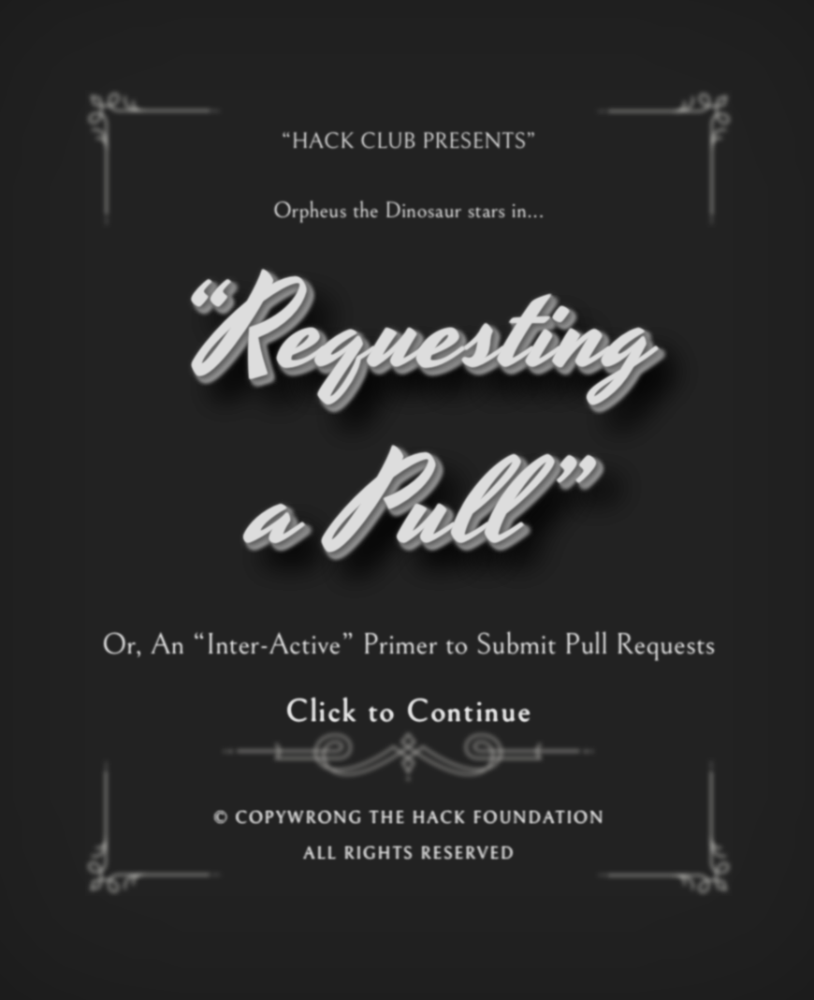

# Make a Dino

Hack Club's workshop on submitting PRs on GitHub

```sh
# install
$ git clone https://github.com/hackclub/draw-dino
$ cd draw-dino
$ bun install

# run a live-reloading server in development
$ bun run dev
```

Before committing, make sure to run the built-in formatter:

```sh
$ bun run fmt
```
